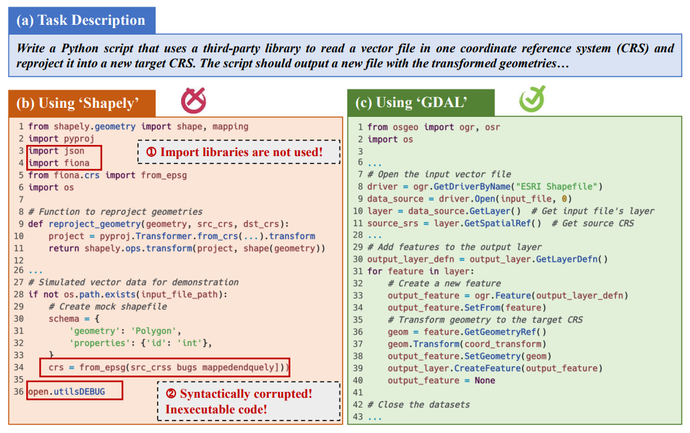

# AI Coding Proficiency

## TL;DR

We conduct the first comprehensive empirical study examining AI proficiency
across 170 third-party libraries and 61 task scenarios, evaluating six widely used LLMs. Our findings reveal that
libraries with similar functionalities can exhibit up to 84% differences in the quality score of LLM-generated
code, while different models also exhibit quality gaps among their generation results using the same library

This repository contains the prototype of both the dataset construction pipeline and the evaluation scripts, as well as our datasets and analysis results.

## Repo Structure

```
- cases/
 - Motivation
 - OtherCases
- code/
 - dataset_generation.py
 - code_evalution.py
 - ppl_utils
- dataset/
 - 0_dataset.pkl
 - 0_scenarios.pkl
- experimental_results/
 - RQ1
 - RQ2
 - RQ3
- README.md
- requirements.txt    
```

## Setup

Our code is implemented on Python 3.9.21.
To install all dependencies, please get into this directory and run the following command.
```
pip install -r requirements.txt
```

If you want to use the `query_llm` function (implemented in Line 40 of this [file](./code/ppl_utils/utils.py)) to access the model, please first configure the corresponding API key in this [file](./code/ppl_utils/config.cfg).


## Motivation

Two technologies with similar functionality or even similar popularity can have significant differences in AI proficiency.
Consequently, selecting a technology without considering AI coding proficiency can introduce extra
debugging costs and even hidden risks for software development.
In the following motivation case, the LLM (GPT-4o) is asked to generate Python scripts that read a vector file in a coordinate reference system (CRS) and reproject it to a new CRS using the specified third-party library.
The only difference between the two prompts is the requested library, the
open-source library Shapely (for analyzing and manipulating geometric objects, with 4.2k stars on GitHub) and GDAL (for reading, writing, and reprojecting vector and geometric data, with 5.5k stars on GitHub).
When using the Shapely library, the LLM produces a lower-quality code snippet that contains syntax errors.
In contrast, when using the GDAL library, the LLM generates high-quality, executable code snippets.
The complete code and the generation results of repeated runs are in [this dir](./case/Motivation).




## Dataset and Evaluation

To build the comprehensive dataset, we collect 170 libraries across 61 scenarios, as shown in this [file](./dataset/0_scenarios.pkl).
Then, we build an automated prompt generation pipeline to generate prompts for third-party libraries. The script is shown in this [file](./code/dataset_generation.py)
The complete dataset is in this [file](./dataset/0_dataset.pkl).

Building on existing work, we implement multiple metrics to evaluate LLM-generated code snippets across five dimensions.
This [file](./code/code_evalution.py) provides a script for evaluating the code and extracting code quality scores.
This script first queries the model using each prompt from the dataset, then evaluates the generated code snippets using these metrics.
Finally, it extracts and normalizes the scores to a range of 0-100 and saves them in a log file.
The parameters of this script are as follows:

1. `dataset_path`: Specifies the dataset location; this parameter does not need to be modified.
2. `output_dir`: Specifies where the LLM-generated code is saved. The default value is `./results`.
3. `model`: Specifies the model to access. Optional parameters include: `[mini, 4o, claude-sonnet-4-20250514, gemini-2.5-flash, qwen3-coder-plus-2025-07-22, deepseek-reasoner]`.
4. `repeat`: Specifies the number of repeated queries. The default value is `5`.
5. `result_pkl`: Specifies the name of the log file that records the path of the LLM-generated code snippets (in the `output_dir` directory). The default value is `result.pkl`.
6. `score_path`: Specifies the name of the log file that records the quality scores of each generated code snippet (in the `output_dir` directory). The default value is `result-scores.pkl`.

## Analysis Results

We provide more results and data in this [directory](./experimental_results) to supplement the analysis of our RQs.

### RQ1

We have supplemented the radar charts that compare different libraries and different models in this [directory](./experimental_results/RQ1/radar) to show the differences in AI proficiency across different models and libraries, emphasizing the significance of incorporating AI proficiency into the technology stack selection framework.
All analysis results of RQ1 are saved in this [file](./experimental_results/RQ1/rq1-analyze.pkl).


### RQ2

In this RQ, we study the failure pattern of low-quality code snippets generated by LLM, extracted eight failure patterns, and provided corresponding cases in this [directory](./case/OtherCase).
All analysis results of RQ2 are saved in this [file](./experimental_results/RQ2/rq2.pkl).


### RQ3

In this experiment, we evaluate the impact of three different prompting methods on AI proficiency of different libraries, and the analysis results of RQ3 are saved in this [file](./experimental_results/RQ3/rq3.pkl).
